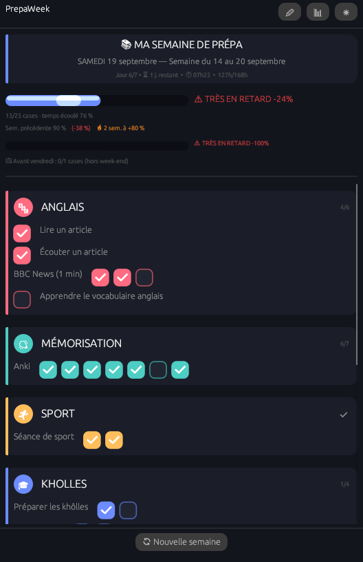
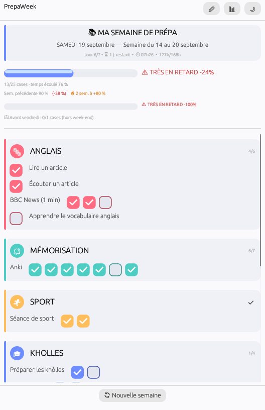
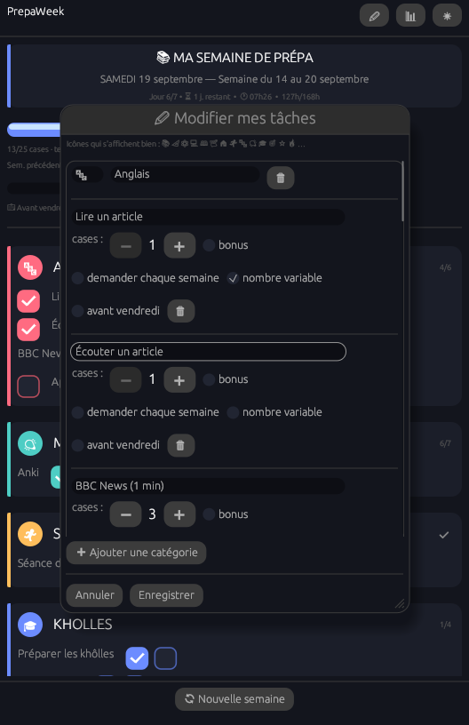
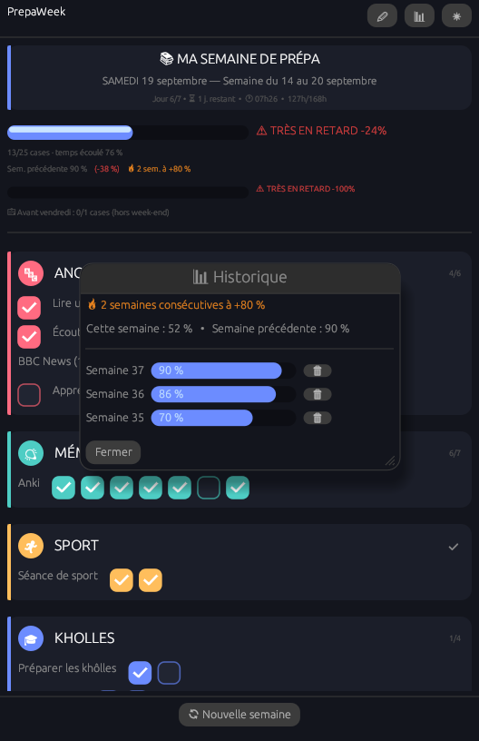
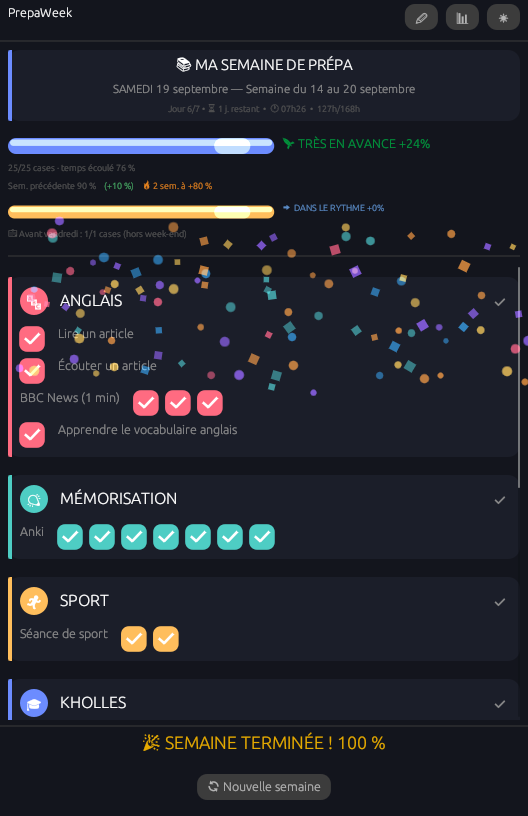

# PrepaWeek — v1.1

  
  

  
  

  

## Nouveautés de cette version : mise en page compacte

**En-tête réduit et stylé comme les cartes** — "MA SEMAINE DE PRÉPA" tient
maintenant sur 3 lignes courtes dans une carte à barre d'accent bleue,
comme les catégories, au lieu d'un gros titre + 4 lignes séparées.

**Barres de progression compactées** — la barre et le palier ("🚀 EN
AVANCE +12 %") sont désormais sur la même ligne au lieu de deux, pour la
progression principale comme pour la barre "avant vendredi". La
comparaison avec la semaine précédente et la série sont aussi regroupées
sur une seule ligne compacte.

**Plus de place pour les tâches** — l'espace récupéré profite directement
à la liste des tâches, qui n'a plus besoin de se réduire autant : on voit
désormais 3 à 4 catégories complètes sans défiler, contre 1 à 2 avant.

## v1.0 : refonte visuelle complète

**Cartes de catégories colorées** — chaque catégorie a sa propre couleur
d'accent (rose, turquoise, ambre, indigo, violet, vert, corail, menthe —
attribuée automatiquement selon l'ordre dans `config.toml`), avec :
- une barre latérale colorée,
- un badge icône rond,
- un compteur "X/Y" discret dans le coin, remplacé par ✅ une fois complète,
- un fond légèrement teinté, avec coins arrondis.

**Cases à cocher animées** — remplacent les cases standard : carré arrondi
qui se remplit en fondu avec la couleur de la catégorie, coche blanche qui
se dessine par-dessus. Beaucoup plus satisfaisant à cocher.

**Barres de progression personnalisées** — remplissage arrondi en couleur
pleine, reflet brillant en haut, et un chatoiement animé qui balaie
doucement la barre en continu. Couleur différente pour la barre principale
(bleu indigo) et la barre "avant vendredi" (ambre), pour bien les
distinguer visuellement.

**Confettis enrichis** — mélange de cercles et de petits carrés qui
tournent sur eux-mêmes en tombant, plus nombreux qu'avant.

**Thème général retravaillé** — palette de couleurs plus riche en clair
comme en sombre, coins arrondis partout (fenêtre, cartes, boutons,
fenêtres de dialogue), espacement plus aéré.

**Note technique** — l'appli tourne maintenant en rafraîchissement continu
(plutôt que seulement quand quelque chose bouge) pour que le chatoiement
des barres reste fluide en permanence. Sur ordinateur de bureau ça ne se
remarque pas ; sur portable, ça consomme un peu plus qu'avant quand la
fenêtre est ouverte et inactive.

## Compiler en .exe (sur Windows)

1. Installe Rust si besoin : https://rustup.rs
2. Terminal dans ce dossier → `cargo build --release`
3. L'exe est dans `target\release\prepa_week.exe`, avec son icône
   personnalisée (`PrepaWeek_icon.ico`, doit rester à côté de
   `Cargo.toml` — c'est `build.rs` qui l'intègre automatiquement à la
   compilation, tu n'as rien à faire de plus). Si jamais l'outil de
   compilation de ressources Windows (`rc.exe`) n'est pas trouvé sur ta
   machine, la compilation continue quand même, juste sans icône
   personnalisée (un avertissement s'affiche) — il est normalement fourni
   avec les Build Tools / le SDK Windows installés par rustup pour la
   chaîne MSVC.

`config.toml` doit rester à côté de l'exe. `state.json`, `history.json` et
`prefs.json` sont créés/mis à jour automatiquement.

Un `Cargo.lock` est fourni (versions connues comme fonctionnelles). Tu peux
le supprimer sans risque avec un rustup à jour sur Windows.

## Champs disponibles pour une tâche (config.toml ou éditeur "✏")

| Champ | Défaut | Effet |
|---|---|---|
| `name` | — | Nom affiché |
| `occurrences` | 1 | Nombre de cases sur la semaine |
| `count_in_progress` | true | false = tâche "bonus" (case inversée dans l'éditeur), hors avancement |
| `ask_include` | false | true = inclusion redemandée chaque semaine ("demander chaque semaine") |
| `ask_occurrences` | false | true = nombre redemandé chaque semaine ("nombre variable") — reste modifiable dans l'éditeur, s'applique tout de suite |
| `weekday_only` | false | true = suivie aussi dans la barre "avant vendredi" |

## Écrans disponibles (barre du haut)

- **✏ Modifier mes tâches** — ajouter/modifier/supprimer catégories et
  tâches, avec info-bulles au survol pour chaque option.
- **📊 Historique** — semaines passées, série en cours, comparaison ; 🗑
  pour supprimer une semaine (erreur, test).
- **☀/🌙** — bascule clair/sombre, sauvegardée.

## Icônes

Confirmées comme s'affichant correctement (testées) :
📚 📐 ⚛ 💻 📖 📝 🏠 🏃 🔄 🎉 🚀 ⚠ ⏳ ✅ 🔥 ⭐ 🏆 📈 ☑ ☐ 💪 🎯 📅 📓 🔤 📄 🌟 🏁
🎓 ⏰ ▶ 🔊 📢 📊 🔔 🔒 🔓 ➕ ➖ ➡ 🖥 🍽 🗑 💡 ☀ 🌙 ✏

À éviter (invisibles ou cassés avec cette police) : 🇬🇧 (et tous les
drapeaux), 🧠, 🧮, 🧹, 🧭, 🗓, ↑, ↓, → (flèche fine), 🟢, 🟠, ∅.

## Fichiers générés par l'appli

- `state.json` — cases cochées + choix de la semaine en cours.
- `history.json` — archive des semaines passées (jusqu'à 104, ~2 ans).
- `prefs.json` — préférence clair/sombre.

## Suite prévue

- Gamification (XP, niveaux), maintenant que l'historique existe pour lui
  donner une trajectoire — dis-moi si tu veux qu'on l'ajoute.
